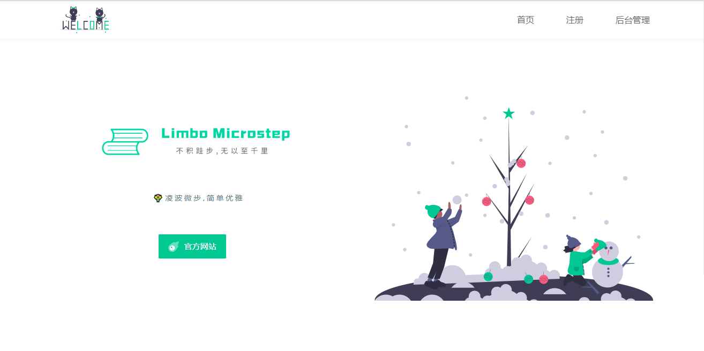

<div align="center">
<br/>
<br/>
  <h1 align="center">
    Limbo Microstep
  </h1>
  <h4 align="center">
    千 里 之 行 , 始 于 足 下
  </h4> 

  [预 览](http://flask.pearadmin.com)   |   [官 网](http://www.taoxiaoxin.club/)   |   [社区](http://www.taoxiaoxin.club/)


<p align="center">
    <a href="#">
        
    </a>
    <a href="#">
        
    </a>
      <a href="#">
        
    </a>
</p>
</div>

<div align="center">
  
</div>

#### 项目简介
本项目基于 Pear Admin Flask 前端页面，拥抱应用广泛的python语言


#### 项目架构
flask 2.2.2 +	Python 3.10 +  APScheduler 定时任务

#### 版本特性:
相较于上个版本更加轻量,只需要将账号导入到csv文件中即可.

####  项目结构

```
limbo-step
├─applications  # 应用
│  └─views  # 视图部分
├─configs  # 配置文件
├─docs  # 文档说明（占坑）
├─templates  # 静态模板文件
├─static     # 静态资源文件
├─requirement  # 依赖文件
├─libs # 第三方包
├─test # 测试文件夹（占坑）
└─.env # 项目的配置文件

```
## Limbo Microstep 使用指南

<br />

#### 项目安装

```bash
# 下 载
git clone https://github.com/tao-xiaoxin/limbo-step.git

# 安 装
pip install -r requirements.txt

# 配 置
cp .flaskenv .env

```

#### Venv 安装

```bash
python -m venv venv
```

#### 运行项目

```bash

#执行命令启动项目 

flask run 
```


### Limbo Microstep 部署指南

#### 运行项目

```bash
# 运行项目
chmod -777 scf_bootstrap
bash scf_bootstrap
```

### 使用腾讯云serverless
```bash
# 安装serverless
npm install -g serverless

# 部署limbo-step
scf deploy

```

### 使用阿里云serverless
```bash
# 安装serverless
npm install -g @serverless-devs/s
# 部署limbo-step
s deploy -y 
```

### 预览项目

|                        |                        |
|------------------------|------------------------|
|  |  |

## 注意事项

1. 每天早上8点定时同步!

2. (pushplus)推送+注册地址 [点我](https://www.pushplus.plus/login.html)

3. 如果支付宝没有更新步数,到小米运动->设置->账号->注销账号->清空数据,然后重新登录,重新绑定第三方

4. 小米运动不会更新步数，只有关联的会同步！！！！！

5. 请注意，账号不是 [小米账号]，而是 [小米运动] 的账号。

6. 只有关联了[推送加]，才能推送步数到微信

### 参考资料:
1. [腾讯云serverless安装环境](https://www.tencentcloud.com/zh/document/product/1040/36249)
2. [腾讯云serverless远程开发调试](https://cloud.tencent.com/document/product/583/45474)
3. [阿里云serverless常用命令](https://docs.serverless-devs.com/fc/readme)
4. [阿里云serverless工具安装](https://docs.serverless-devs.com/serverless-devs/quick_start#%E5%B7%A5%E5%85%B7%E5%AE%89%E8%A3%85)

